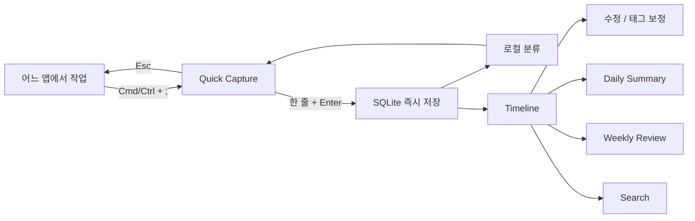

# Trace — AI-Native Working Memory

## 1. Product Requirement Document

### 문제

업무일지의 실패 원인은 기록 의지보다 회상·정리 비용이다. 기존 도구는 사용자가 이미 정리된 문장을 입력한다고 가정한다.

### 제품 명제

Trace는 업무일지가 아니라 생각의 임시 외장 메모리다. 사용자는 짧은 흔적을 남기고, 시스템이 시간·맥락·형태를 보완한다.

### 핵심 목표

1. 어느 앱에서든 2초 안에 기록을 시작한다.
2. 한 줄 입력과 Enter만으로 영구 저장한다.
3. 원문을 보존하면서 자동 분류한다.
4. 하루와 일주일의 흐름을 다시 볼 수 있게 한다.
5. AI 없이도 캡처·조회·검색이 완전히 동작한다.

### MVP 성공 지표

- 첫 기록 완료 시간 중앙값 5초 이하
- 캡처 호출 후 이탈률 10% 이하
- 주 4일 이상 기록한 활성 사용자 비율
- 기록 20개 이상 사용자 중 검색/요약 재방문율

### MVP 범위

포함: 글로벌 캡처, 즉시 저장, 타임라인, 수정/삭제, 로컬 자동 분류, 키워드형 자연어 검색, 일간/주간 로컬 요약, 설정.

제외: 계정, 클라우드 동기화, 협업, 첨부 파일, 벡터 DB, 자동 화면 감시, 캘린더 연동, 외부 AI 실제 호출.

### 원칙

- 캡처 경로에는 네트워크 요청을 두지 않는다.
- AI 결과는 원문을 덮어쓰지 않는다.
- 자동화보다 수정 가능성을 우선한다.
- 새 화면보다 기존 화면의 조용한 상태 변화를 선호한다.

## 2. User Flow



## 3. Information Architecture

```text
Trace
├─ Quick Capture (독립 오버레이)
├─ 흔적
│  └─ 시간순 기록 / 편집
├─ 오늘
│  └─ 결정 / 진행 업무 / 아이디어 / 질문
├─ 이번 주
│  └─ 기록량 / 결정 / 아이디어 / 반복 맥락
├─ 찾기
│  └─ 자연어형 검색 입력 / 결과
└─ 설정
   ├─ 글로벌 단축키
   ├─ AI Provider
   └─ 테마
```

## 4. Database Schema

```sql
CREATE TABLE notes (
  id INTEGER PRIMARY KEY AUTOINCREMENT,
  content TEXT NOT NULL,
  created_at TEXT NOT NULL,
  updated_at TEXT NOT NULL,
  tags TEXT NOT NULL DEFAULT '[]',
  project TEXT,
  category TEXT NOT NULL DEFAULT '업무'
);

CREATE INDEX idx_notes_created_at ON notes(created_at);
CREATE INDEX idx_notes_category ON notes(category);
```

MVP에서는 태그를 JSON 문자열로 둔다. 태그 기반 통계가 병목이 되는 시점에만 `note_tags` 정규화 테이블을 추가한다.

## 5. Screen Design

### Quick Capture

- 620×78 무프레임 floating window
- 아이콘, 단일 입력, 저장 피드백, Enter 힌트만 노출
- Enter 후 창을 닫지 않아 생각을 연속 투입 가능
- Esc로 즉시 닫기

### Timeline

- 날짜 축과 시간순 한 줄 기록
- 태그와 카테고리는 보조 정보로만 표시
- 행 클릭 시 작은 편집 dialog

### Summary / Review

- 일간은 네 가지 버킷 카드
- 주간은 설명 가능한 문장 3개부터 시작
- “AI가 작성한 완성된 보고서”처럼 과장하지 않는다

### Visual Language

- 따뜻한 회백색 배경, 얇은 선, 단일 주황 포인트
- 낮은 대비의 navigation
- 그림자와 animation 최소화
- dense dashboard 대신 여백과 시간 축 사용

## 6. Component Structure

```text
App
├─ Sidebar
├─ PageHeader
├─ Timeline
│  └─ NoteRow
├─ SummaryGrid
│  └─ SummaryCard
├─ SettingsForm
└─ EditDialog

Capture
└─ CaptureForm
```

현재 규모에서는 상태 라이브러리와 컴포넌트 폴더 분리를 하지 않는다. 파일이 읽기 어려워질 때 분리한다.

## 7. API Structure

Tauri command가 로컬 API다.

| Command | Input | Output |
|---|---|---|
| `create_note` | `content` | `Note` |
| `list_notes` | `query` | `Note[]` |
| `update_note` | `id, content, tags` | `Note` |
| `delete_note` | `id` | `void` |
| `daily_summary` | `date?` | `Summary` |
| `weekly_summary` | 없음 | `string[]` |
| `get_settings` | 없음 | `Settings` |
| `save_settings` | `Settings` | `void` |

향후 AI adapter 계약:

```ts
type AiProvider = {
  classify(text: string): Promise<Classification>;
  summarize(notes: Note[], period: "day" | "week"): Promise<Summary>;
  search(query: string, notes: Note[]): Promise<number[]>;
};
```

Provider 실패 시 로컬 결과를 반환하며 캡처 저장은 AI 호출과 분리한다.

## 8. Folder Structure

```text
.
├─ docs/PRODUCT.md
├─ src/
│  ├─ App.tsx
│  ├─ Capture.tsx
│  ├─ api.ts
│  ├─ types.ts
│  └─ styles.css
└─ src-tauri/
   ├─ capabilities/default.json
   ├─ src/lib.rs
   ├─ src/main.rs
   ├─ Cargo.toml
   └─ tauri.conf.json
```

## 9. MVP 개발 로드맵

### 1주차 — 기록 루프

- Tauri shell, SQLite, Quick Capture, 글로벌 단축키
- create/list/update/delete
- 크래시와 데이터 유실 검증

### 2주차 — 회상 루프

- Timeline, 검색, 일간/주간 로컬 요약
- 분류 규칙 보정
- Windows/macOS 패키징

### 3주차 — 실제 사용 검증

- 1주 dogfooding
- 캡처 시간, 오분류, 검색 실패 사례 수집
- 실제 실패 데이터가 확인된 항목만 수정

## 10. 향후 확장 계획

1. OS keychain 기반 provider API key 보관과 OpenAI/Claude/Gemini adapter
2. SQLite FTS5 검색, 필요 시에만 local embedding
3. 프로젝트 alias 학습과 사용자별 분류 사전
4. Markdown/JSON export와 암호화 백업
5. 사용자 선택형 context capture(활성 앱 이름 등)
6. 여러 기기 요구가 검증된 뒤 end-to-end encrypted sync

### 확장 조건

- FTS5: 5천 건 이상에서 LIKE 검색 지연이 체감될 때
- 벡터 검색: 키워드 검색 실패 사례가 반복될 때
- 클라우드 동기화: 두 기기 사용 요구가 핵심 이탈 원인일 때
- 자동 관찰: 명시적 기록만으로 회상 가치가 부족하다는 증거가 있을 때


## 11. Decision Context Update

Trace의 기본 단위는 업무 완료 로그가 아니라 의사결정의 맥락이다. 사용자는 아침에 Must / Should / Could 계획을 작성하고, 업무 중에는 결정·요구사항 변경·아이디어·문제·피드백만 캡처한다. 퇴근 시 계획 완료 여부를 체크하면 시스템이 완료한 업무와 주요 맥락을 결합해 하루를 복원한다.

### plans schema

```sql
CREATE TABLE plans (
  id INTEGER PRIMARY KEY AUTOINCREMENT,
  date TEXT NOT NULL,
  priority TEXT NOT NULL CHECK(priority IN ('Must','Should','Could')),
  content TEXT NOT NULL,
  completed INTEGER NOT NULL DEFAULT 0
);
```

### Updated daily flow

`오늘 계획 + 업무 중 맥락 기록 + 완료 여부 → 오늘의 기록`

### Updated visual system

- Background #FFFFFF
- Surface #FAFAFA
- Border #E5E7EB
- Primary text #111827
- Secondary text #6B7280
- 장식성 아이콘과 감성 카피 제거
- 목록 행 hover 시 편집/삭제 액션 노출
